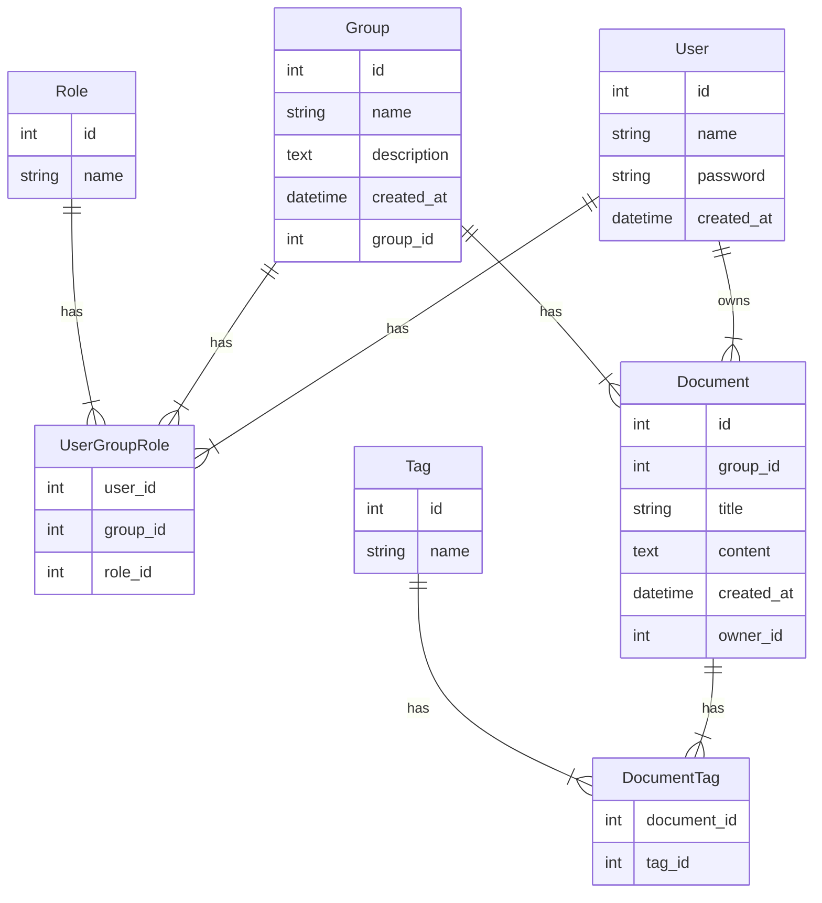

```mermaid
erDiagram
    User ||--|{ UserGroupRole : has
    Group ||--|{ UserGroupRole : has
    Role ||--|{ UserGroupRole : has
    User ||--|{ Document : owns
    Group ||--|{ Document : has
    Document ||--|{ DocumentTag : has
    Tag ||--|{ DocumentTag : has

    User {
        int id
        string name
        string password
        datetime created_at
    }

    Group {
        int id
        string name
        text description
        datetime created_at
        int group_id
    }

    Role {
        int id
        string name
    }

    UserGroupRole {
        int user_id
        int group_id
        int role_id
    }

    Document {
        int id
        int group_id
        string title
        text content
        datetime created_at
        int owner_id
    }

    Tag {
        int id
        string name
    }

    DocumentTag {
        int document_id
        int tag_id
    }

```